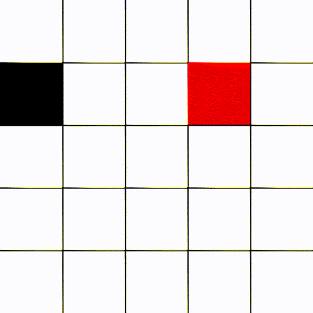

# Snake 5x5-reinforcement-learning
  
Actor Critic reinforcement learning  
Max points: 21 (23 length out of 25 fields)  
  
Instructions:  
Q-show graph  
W-on/of showing game  
E-on/of slowing game and printing action probability  
S-save the graph  
  
  
(You can uncomment lines 177,222-228 and comment lines 231-278 to play the game by yourself)
